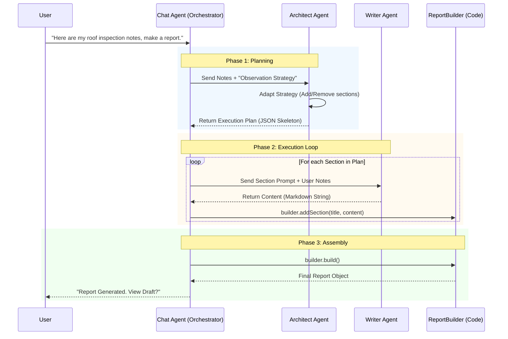

# DeskHQCapstone

# ARCHITECTURE RULES: Report Generation & Chatbot

## 1. Report Editing Strategy: "Hybrid Serialization"

**Goal:** Combine the structural integrity of JSON with the editing fluidity of LLMs.

- **Data Storage (Database):**
  - Keep the report stored as **Strict JSON** (`{ id, type, content, metadata }`).
  - Allows efficient loading, schema enforcement, and partial fetching of sections.
- **AI Context (The View):**
  - **Serialization (`toMarkdown`):** Dynamically convert the target JSON section into clean Markdown/XML before sending to the LLM.
  - **Example:** Convert `{ "type": "image", "src": "url" }` → ``.
- **Editing Process:**
  - The LLM edits the **Markdown** representation (Cursor-style streaming text).
  - **Deserialization (`fromMarkdown`):** The backend parses the LLM's Markdown output back into JSON fields to update the database.
- **Why:** Prevents "JSON syntax errors" (missing commas/brackets) while allowing the AI to naturally "rewrite" content and swap images using standard text links.

## 2. Chatbot Logic: "Hybrid Tools"

**Goal:** Robustness for different types of user intent.

- **For Text/Content Editing:**
  - **Use Diff/Patch Streaming.** Do not use function calls for rewriting paragraphs. Pass the text context and let the LLM output the new version directly. Apply changes via diff algorithm.
- **For RAG & Data Retrieval:**
  - **Use Strict Tooling (Structured Output).** Use explicit JSON schemas/function calling for "Search Vector Store," "Get Cement Prices," or "Query Metadata."
  - _Reasoning:_ Separates the "Creative Writer" (fluid text) from the "Database Admin" (strict logic).

# Agentic Report Generation Pipeline

### High-Level Workflow

This architecture separates **control logic** (JSON/Code) from **generative content** (Markdown/Text). It utilizes the **Strategy Pattern** for consistency and the **Builder Pattern** for type-safe assembly.



### 1. The Roles

| Component      | Type                 | Responsibility                                                                                                                   | Input                  | Output                     |
| :------------- | :------------------- | :------------------------------------------------------------------------------------------------------------------------------- | :--------------------- | :------------------------- |
| **Chat Agent** | **Orchestrator**     | Interface between User and Backend. Manages state, triggers the workflow, and handles errors.                                    | User Natural Language  | Triggers & Status Updates  |
| **Templates**  | **Strategy Pattern** | Static definitions of standard report types (e.g., _Observation_, _Incident_, _Daily Log_). Prevents hallucination of structure. | N/A                    | `SectionBlueprint[]`       |
| **Architect**  | **LLM (Planner)**    | Adapts the selected Template based on specific user notes. Decides _what_ to write, not _how_.                                   | User Notes + Template  | `ExecutionPlan` (JSON)     |
| **Writer**     | **LLM (Executor)**   | Generates the actual prose for a single section. Focuses purely on tone, grammar, and detail.                                    | Section Prompt + Notes | `Content` (Markdown)       |
| **Builder**    | **Code (Class)**     | Type-safe state container. Handles IDs, timestamps, and structure validation.                                                    | Strings & Configs      | `Report` Object (DB Ready) |

### 2. The Process Detail

#### Phase 1: Intake & Planning (Chat Agent + Architect)

1.  **Intake:** The **Chat Agent** identifies the user's intent ("Create Report") and selects the appropriate **Strategy** (e.g., `ObservationReportTemplate`).
2.  **Reasoning:** The Chat Agent passes the _User Notes_ and the _Strategy_ to the **Architect**.
3.  **Planning:** The Architect analyzes the notes.
    - _Decision:_ "The user mentioned severe roof damage. I will add a specific '2.1 Roof Inspection' section to the standard template."
4.  **Output:** Returns a **JSON Plan** (a list of tasks), not the full report.

#### Phase 2: The Execution Loop (Chat Agent + Writer + Builder)

The **Chat Agent** (or a backend job runner) iterates through the JSON Plan.

1.  **Loop Start:** For `PlanItem[i]`:
2.  **Generation:** Send specific instructions to the **Writer Agent**.
    - _Prompt:_ "Write Section 2.1. Focus on the water intrusion described in the notes."
    - _Format:_ Output is pure **Markdown** (easier for LLMs than JSON strings).
3.  **Ingestion:** The Chat Agent receives the Markdown and immediately pushes it to the **ReportBuilder**.
    - `builder.addSection("2.1 Roof Inspection", markdownContent)`
4.  **Serialization:** The Builder handles the messy work: generating UUIDs, setting `orderIndex`, and creating `ReportSection` objects.

#### Phase 3: Assembly & Review

1.  **Build:** Once the loop finishes, call `builder.build()`.
2.  **Validation:** The Builder ensures all required fields (`projectId`, `title`, `status`) are valid.
3.  **Persistence:** The final object is saved to the database.
4.  **Feedback:** The **Chat Agent** confirms completion to the user: "Draft created with 4 sections. Would you like to review?"

### 3. Key Data Structures

**The Plan (From Architect)**
_JSON strict, low tokens._

```json
[
  {
    "id": "sec_1",
    "title": "1.0 Intro",
    "intent": "Summarize site location..."
  },
  {
    "id": "sec_2",
    "title": "2.0 Observations",
    "intent": "Detail the cracks..."
  }
]
```

**The Content (From Writer)**
_Markdown text, high tokens._

```markdown
# 2.0 Observations

During the visual inspection, we observed hairline fractures...
```

**The Final Object (From Builder)**
_Rich Domain Object, Database ready._

```typescript
{
  "reportId": "uuid-123",
  "status": "DRAFT",
  "sections": [
    {
      "id": "uuid-999",
      "title": "2.0 Observations",
      "content": "During the visual inspection...",
      "images": []
    }
  ]
}
```
